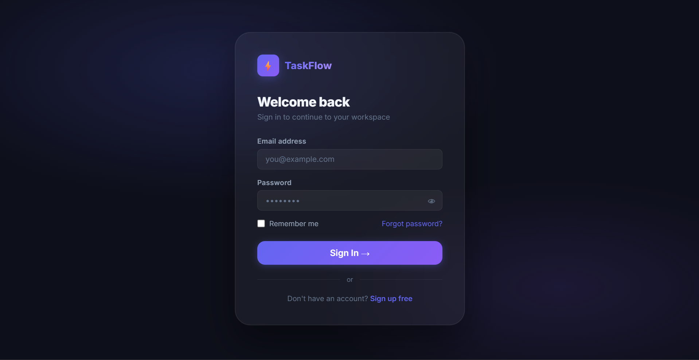

# TaskFlow - Premium Task & Focus Workspace

An interactive, premium dark-themed productivity dashboard that combines structured task planning, a Pomodoro focus engine, monthly scheduling, and custom alarms into a unified client-side interface.

Designed as a **local-first client-side workspace**, TaskFlow executes entirely within your browser to deliver zero server latency and complete data privacy with no installation required.

---

## 🚀 Live Demo
👉 https://Manoj4681.github.io/TaskFlow/

---

## 📷 Screenshots

### Main Workspace View
.png)

### Landing Page


### Sign In Portal


---

## 🌟 Premium Features

* **Smart Alarms & Notifications:** Set custom alert times on individual tasks. At the designated minute, the system plays a synthesized chime via the **Web Audio API** (generating the sound dynamically in the browser) and triggers a native **OS desktop notification**.
* **Pomodoro Focus Timer:** Features customizable sessions for Focus (25m), Short Breaks (5m), and Long Breaks (15m). The timer is visually represented by a smooth, glowing SVG circular progress ring that dynamically updates using CSS offset math.
* **Monthly Planner Grid:** Generates an interactive, responsive monthly calendar grid. Days containing pending items dynamically display color-coded priority dots corresponding to your active tasks.
* **Persistent Quick Notes:** Features an auto-saving sidebar text canvas. Every keyboard stroke is synced instantly to the browser's local storage with a visual confirmation indicator.
* **Glassmorphic Security Portal:** Entry pages constructed with rich CSS backdrop blurs (`backdrop-filter`) featuring real-time password entropy calculation and validation.

---

## 🏃 How to Run

1. Clone the repository:
   ```bash
   git clone https://github.com/Manoj4681/TaskFlow.git
   ```
2. Navigate to the project directory:
   ```bash
   cd TaskFlow
   ```
3. Open **`index.html`** in your browser.

---

## 🛠️ Technology Stack

* **Frontend:** Semantic HTML5, CSS3 Variables, CSS Grid, and Flexbox layouts.
* **Interactivity:** Vanilla JavaScript (ES6+), DOM APIs.
* **Web APIs Used:** Web Storage API (`localStorage`), Web Audio API, and Web Notifications API.
* **Typography:** Inter Google Font.

---

<details>
<summary>📁 File Directory</summary>

```
TaskFlow/
│
├── index.html        🏠  Landing / Home portal
├── todo.html         ✅  Deep Work Workspace
├── calendar.html     📅  Monthly Calendar planner
├── signin.html       🔑  Sign In portal
├── signup.html       🚀  Sign Up portal
├── about.html        ℹ️   Mission & Story view
├── pricing.html      💎  Pricing tiers & FAQ
│
├── style.css         🎨  Centralized Design System
└── nav.js            🔗  Shared Sidebar Navigation & Toast system
```

</details>
